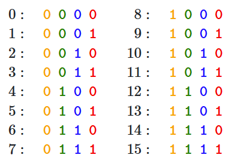

# 从头理解Transformer及Positional Encoding，RoPE
## 1. 简介
人工智能发展至今，Transformer是背后最重要的模型之一，它甚至统一了文本，图像、视频、声音、代码、数学等各个领域。对于这一载入史册的模型，我们有必要从头理解它的原理和细节。
## 2. Attention
Transformer的核心是Scaled Dot-Product Attention机制，简单起见，记query，key，value分别为 $Q, K, V \in \mathbb{R}^{n \times d}$，$d$是hidden size，$n$是序列长度。其计算公式为：
$$
\text{Attention}(Q, K, V) = \text{softmax}(\frac{QK^T}{\sqrt{d}})V
$$
这一公式的含义是：对于每一个query: $q$，我们计算它与所有key的dot product，然后过softmax归一化，最后用这些权重对所有value进行加权求和，即可得到attention的结果。

为了增加模型的表达能力，Transformer采用了多头注意力机制（Multi-Head Attention），即，将$Q, K, V$分别线性变换为$h$组，然后分别计算attention，最后将所有的结果拼接起来再线性变换一次。

其次，为了增加表达能力，Transformer加入了Feed Forward层，与Multi-Head Attention层一起，构成了Transformer的基本单元（Block）。Transformer的Encoder由多个Block堆叠而成，Decoder也是如此。

除此之外，Transformer还加入了Layer Normalization和Residual Connection来进一步提升模型的性能。接下来，我们介绍Transformer中两个重要的设计细节：1. Attention为什么要除以根号d 2. Positional Encoding
## 3. 为什么要除以根号d
我们从softmax梯度的角度来理解这个问题。设经过softmax之后得到的概率为$p_i=e^{x_i}/\sum_j e^{x_j}$，那么:

$$
\frac{\partial p_i}{\partial x_j} = \begin{cases} p_i - p_i^2, & i = j \\ - p_i p_j, & i \neq j \end{cases}
$$
如果$x_i$中某个值比较大，那么softmax就接近于one-hot，进而所有$\frac{\partial p_i}{\partial x_j}$也就接近于0，导致梯度消失。实际上，我们也能直观地从导数的定义上感受到这一点，当softmax接近于one-hot时，给某个$x_i$加一个小的扰动，所有$p_i$的变化都很小，故而导数接近于零。

我们接下来从输入的均值和方差的角度来分析下其大小范围，即，$q \cdot k = \sum_i q_i k_i$的均值和方差。我们假设$q$和$k$的各个元素独立同分布且均值为0，方差为1，那么：
$$
\mathbb{E}[q \cdot k] = \sum_i \mathbb{E}[q_i] \mathbb{E}[k_i] = 0
$$
方差为：
$$
\begin{aligned} 
\mathbb{Var}[q \cdot k] 
=&  \mathbb{E}[(q \cdot k)^2] - (\mathbb{E}[q \cdot k])^2 \\
=&  \mathbb{E}[(q \cdot k)^2] \\
=&\,\mathbb{E}\left[\left(\sum_{i=1}^d q_i k_i\right)^2\right] = \mathbb{E}\left[\left(\sum_i q_i k_i\right)\left(\sum_j q_j k_j\right)\right]\\ 
=&\,\mathbb{E}\left[\sum_{i}\sum_{j} (q_i q_j) (k_i k_j)\right] = \sum_{i}\sum_{j} \mathbb{E}[q_i q_j] \mathbb{E}[k_i k_j]\\ 
=&\,\sum_i \mathbb{E}[q_i^2] \mathbb{E}[k_i^2] = d 
\end{aligned}
$$
当$d$较大时，$q \cdot k$的方差较大，就有可能取到较大的值，导致梯度消失。我们将$q \cdot k$除以$\sqrt{d}$使其方差为1，这样就能有效缓解梯度消失的问题。

## 4. Positional Encoding
Attention中尚未涉及序列的位置信息，为了引入位置信息，Transformer加入了Positional Encoding。Sinusoid Positional Encoding为：
$$
\begin{aligned} 
PE_{(t, 2i)} =& \sin(t/10000^{2i/d}) \\
PE_{(t, 2i+1)} =& \cos(t/10000^{2i/d})
\end{aligned}
$$
其中，$t$是位置，$2i, 2i+1$是维度index，$d$是hidden size可以被2整除。$i \in [0, \cdots, d/2-1]$。Sinusoid的周期（波长）是一个从$2\pi$到$10000^{(d-2)/d} \cdot 2\pi$的等比数列。

为什么要用一系列不同周期的sinusoid来编码位置信息呢？我们先回到数的二进制编码来找找灵感。将0到15按照二进制形式写出来：

我们可以看到，最低位红色的周期是2，接下来蓝色位的周期是4，绿色位的周期是8，最高位的周期是16。如果我们将每一位的取值从离散的0,1变为连续的0到1，周期变为$2\pi$到$10000^{(d-2)/d} \cdot 2\pi$的等比数列，那么我们就得到了Sinusoid Positional Encoding：

其中横轴是维度index，纵轴是位置$t$，每一行表示一个Positional Encoding向量。所以，**Sinusoid Positional Encoding可以近似理解为位数为$d$的$10000^{2/d} \cdot 2\pi$进制连续编码。**

最后，论文中有一句很关键的话："We chose this function because we hypothesized it would allow the model to easily learn to attend by relative positions, since for any fixed offset $k$, $PE_{t+k}$ can be represented as a linear function of $PE_t$"

作者的原意是，Sinusoid Positional Encoding可以让模型更容易地学习到相对位置关系。我们从数学的角度来分析下这个问题。记$\omega_i = \frac{1}{10000^{2i / d}}$，根据[旋转矩阵的性质](https://en.wikipedia.org/wiki/Rotation_matrix)，我们立即得到：
$$
\begin{bmatrix}
	    \sin(\omega_i \cdot (t + k)) \\
	    \cos(\omega_i \cdot (t + k))
	\end{bmatrix} = 
    \begin{bmatrix}
        \cos(\omega_i \cdot k) & \sin(\omega_i \cdot k) \\
        - \sin(\omega_i \cdot k) & \cos(\omega_i \cdot k)
    \end{bmatrix}
    \begin{bmatrix}
	    \sin(\omega_i \cdot t) \\
	    \cos(\omega_i \cdot t)
	\end{bmatrix}
$$
等号右边第一项为顺时针旋转$\omega_i \cdot k$的旋转矩阵。确实验证了$PE_{t+k}$可以表示为$PE_t$的线性函数。

然而，这里模型并不能直接利用相对位置信息。设query的位置为m，key的位置为n，我们想让模型直接编码相对位置m-n。考虑到上面旋转矩阵的性质，这一目标也很容易达成，简单起见，我们先考虑$d=2$的情形。分别把query和key逆时针旋转$\omega_0 \cdot m$和$\omega_0 \cdot n$，那么我们得到：
$$
f_q(m) = 
    \begin{bmatrix}
        \cos(\omega_0 \cdot m) & -\sin(\omega_0 \cdot m) \\
        \sin(\omega_0 \cdot m) & \cos(\omega_0 \cdot m)
    \end{bmatrix}
    \begin{bmatrix}
        q_1 \\
        q_2
    \end{bmatrix}
$$
$$
f_k(n) = 
    \begin{bmatrix}
        \cos(\omega_0 \cdot n) & -\sin(\omega_0 \cdot n) \\
        \sin(\omega_0 \cdot n) & \cos(\omega_0 \cdot n)
    \end{bmatrix}
    \begin{bmatrix}
        k_1 \\
        k_2
    \end{bmatrix}
$$
两者的内积为：
$$
\begin{aligned} 
f_q(m) \cdot f_k(n) =& \begin{bmatrix}
        q_1 & q_2
        \end{bmatrix}
    \begin{bmatrix}
        \cos(\omega_0 \cdot m) & \sin(\omega_0 \cdot m) \\
        -\sin(\omega_0 \cdot m) & \cos(\omega_0 \cdot m)
    \end{bmatrix}
    \begin{bmatrix}
        \cos(\omega_0 \cdot n) & -\sin(\omega_0 \cdot n) \\
        \sin(\omega_0 \cdot n) & \cos(\omega_0 \cdot n)
    \end{bmatrix}
    \begin{bmatrix}
        k_1 \\
        k_2
    \end{bmatrix} \\
    =& \begin{bmatrix}
        q_1 & q_2
        \end{bmatrix}
    \begin{bmatrix}
        \cos(\omega_0 \cdot (n-m)) & -\sin(\omega_0 \cdot (n-m)) \\
        \sin(\omega_0 \cdot (n-m)) & \cos(\omega_0 \cdot (n-m))
    \end{bmatrix}
    \begin{bmatrix}
        k_1 \\
        k_2
    \end{bmatrix} \\
\end{aligned}
$$
我们就直接在内积中编码了相对位置（m-n,或者说n-m），这样才算真正完成了Transformer作者的原意。

是不是对上面query和key的旋转操作有点眼熟？对的，我们顺便推导出了Rotary Position Embedding(RoPE)。
## 5. Rotary Position Embedding(RoPE)
对query或key的元素两两一组进行旋转操作，令旋转角度因子$\theta_i = \omega_{i-1} = \frac{1}{10000^{2(i-1) / d}}$，我们即可得到完整的RoPE：
$$
\mathbf{R}_{\Theta,m}^d \mathbf{x} = \begin{pmatrix} x_1 \\ x_2 \\ x_3 \\ x_4 \\ \vdots \\ x_{d-1} \\ x_d \end{pmatrix} \otimes \begin{pmatrix} \cos m \theta_1 \\ \cos m \theta_1 \\ \cos m \theta_2 \\ \cos m \theta_2 \\ \vdots \\ \cos m \theta_{d/2} \\ \cos m \theta_{d/2} \end{pmatrix} + \begin{pmatrix} -x_2 \\ x_1 \\ -x_4 \\ x_3 \\ \vdots \\ -x_{d-1} \\ x_d \end{pmatrix} \otimes \begin{pmatrix} \sin m \theta_1 \\ \sin m \theta_1 \\ \sin m \theta_2 \\ \sin m \theta_2 \\ \vdots \\ \sin m \theta_{d/2} \\ \sin m \theta_{d/2} \end{pmatrix}
$$
query和key两者的内积会包含一系列$\sin(\theta_i \cdot (n-m))$和$\cos(\theta_i \cdot (n-m))$。类似的，这些元素可以理解为相对距离的$10000^{2/d} \cdot 2\pi$进制连续编码
## 6. 展望
Transformer虽然强大，但是它的复杂度为$O(n^2)$，这让它在处理长序列时十分吃力。为了改进Transformer，研究者们提出了FlashAttention，各种机制的sparse attention，以及可以长度外推的RoPE等等。我们可以期待，在不久的将来能处理Billion级别序列的高效Transformer的出现。